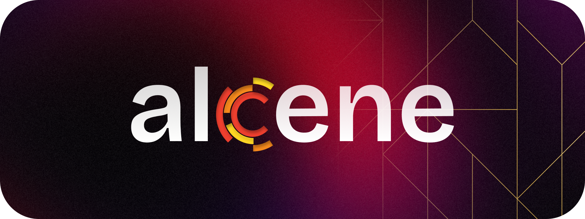

<picture>
  <source
    width="100%"
    srcset="./docs/banner.png"
    media="(prefers-color-scheme: dark)"
  />
  <source
    width="100%"
    srcset="./docs/banner.png"
    media="(prefers-color-scheme: light), (prefers-color-scheme: no-preference)"
  />
  
</picture>

<h1 align="center">alcene.ai</h1>

Lightweight embedded AI inference built from the ground up.

  
  
  
  

> [!NOTE]
> `alcene.ai` is in **pre-launch**. This README describes the vision and direction. Code, benchmarks, and docs land as they are built. Nothing below is shipped yet.

> [!TIP]
> Alcene is an **embedded inference engine**: small, portable, dependency-light, designed to run AI models where your app already lives — not as a sidecar service you have to babysit.

## What's So Special About This Project?

Most inference stacks are heavy: big runtimes, GPU-only paths, server-shaped assumptions. Alcene starts from the opposite end — **ground-up, embedded-first**.

- Embedded: link it in, don't deploy it beside you.
- Lightweight: small footprint, fast startup, sane defaults.
- Ground-up: no inherited bloat, every layer earns its place.

> [!TIP]
> This is a **small, focused project**. The embedded form factor is permanent. Long-term direction grows toward broad model coverage and production hardening while keeping the **lightweight footprint** intact.

## License

MIT — see [`LICENSE`](LICENSE). Copyright (c) 2026 Handaru Daniswara.

## Star History

<a href="https://star-history.com/#daniswastaken/alcene&Date">
  <picture>
    <source media="(prefers-color-scheme: dark)" srcset="https://api.star-history.com/svg?repos=daniswastaken/alcene&type=Date&theme=dark" />
    <source media="(prefers-color-scheme: light)" srcset="https://api.star-history.com/svg?repos=daniswastaken/alcene&type=Date" />
    
  </picture>
</a>
